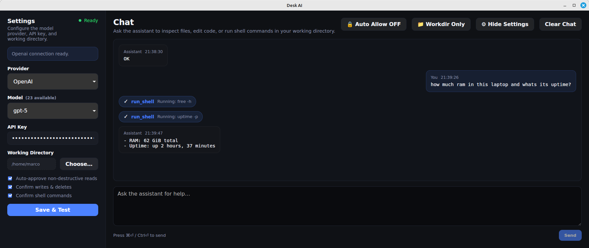

# 🖥️ Desk AI

Your personal AI-powered desktop assistant that can read files, execute commands, and help you get things done—all while keeping you in complete control.



## 🎯 What is Desk AI?

Desk AI is a native desktop application that brings AI assistance directly to your computer. Unlike browser-based tools, Desk AI can actually interact with your files and system—reading code, running commands, searching directories, and automating tasks—all through natural conversation.

Think of it as having an intelligent assistant that understands your system and can help with:

- 🐛 **Debugging issues** by reading logs and analyzing error messages
- 📁 **Managing files** across your projects with smart search and organization
- ⚡ **Automating tasks** like batch operations, file cleanup, or report generation
- 🔍 **Analyzing code** to understand project structure and dependencies
- 🛠️ **System administration** tasks like checking disk space, processes, and configuration

## ✨ Key Features

- **🤖 Your Choice of AI** – Use OpenAI (GPT-5, etc.) or Anthropic Claude
- **🔒 Security First** – Sandboxed workspace mode or optional system-wide access with approval controls
- **✅ Stay in Control** – Review and approve file changes and commands before they execute
- **💬 Real-Time Chat** – See AI responses stream in with live tool execution feedback
- **🌍 System-Wide Mode** – Toggle between restricted workspace or full system access
- **🛠️ Powerful Tools**:
  - Execute terminal commands with streaming output
  - Read, write, and search files
  - List directories and analyze file structure
  - Safe file deletion with confirmation
  - Regex-based multi-file search

## 🚀 Quick Start

### 1. Download & Install

**Option A: Download Pre-built Release (Easiest)**

Go to [Releases](https://github.com/marcodenic/desk-ai/releases) and download the installer for your platform:

- **Windows**: `.msi` installer
- **macOS**: `.dmg` or `.app` bundle
- **Linux**: `.deb`, `.rpm`, or `.AppImage`

**Option B: Build from Source**

If you prefer to build it yourself:

```bash
# Clone the repository
git clone https://github.com/marcodenic/desk-ai.git
cd desk-ai

# Install dependencies
npm install

# Build the Rust backend
cd rust-backend
cargo build --release
cd ..

# Build the application
npm run tauri:build
```

Find your installer in `src-tauri/target/release/bundle/`

### 2. Get an API Key

You'll need an API key from one of these providers:

**OpenAI (GPT-5, GPT-4o, etc.)**

- Sign up at [platform.openai.com/signup](https://platform.openai.com/signup)
- Go to [API Keys](https://platform.openai.com/api-keys) to create a new key
- Recommended models: `gpt-4o`, `gpt-4o-mini`, `gpt-4-turbo`

**Anthropic (Claude)**

- Sign up at [console.anthropic.com](https://console.anthropic.com)
- Go to [API Keys](https://console.anthropic.com/settings/keys) to create a new key
- Recommended models: `claude-3-5-sonnet-latest`, `claude-3-5-haiku-latest`

💡 **Tip**: Both providers offer free trial credits to get started!

### 3. Configure Desk AI

1. **Launch the application**
2. **Click the Settings icon** (⚙️) in the top-right
3. **Choose your provider** (OpenAI or Anthropic)
4. **Select a model** from the dropdown
5. **Paste your API key**
6. **Choose a working directory** where the AI can operate
7. **Click "Save & Test"** to verify your credentials

### 4. Start Using It!

Try asking:

- _"Show me all Python files in this directory"_
- _"Find TODO comments in my code"_
- _"What's using the most disk space?"_
- _"Check if port 8080 is in use"_
- _"Search all log files for errors from today"_

## 🔐 Security & Permissions

**Workspace Mode (Default)**

- All file operations restricted to your chosen directory
- Prevents accidental changes outside your project
- Great for isolated development work

**System-Wide Mode**

- Access files anywhere on your system
- Toggle with the 🌍 button in the top-right
- Still requires approval for destructive operations

**Approval Controls**

- ✓ Auto-approve file reads and listings
- ✓ Confirm writes and deletions
- ✓ Confirm shell commands
- ✓ Full auto-approve mode (use with caution)

All API keys are stored locally on your computer and never sent anywhere except to your chosen AI provider.

## 💡 Example Use Cases

### Real-World Problems Desk AI Can Solve

**System Troubleshooting**

```
"My Bluetooth keeps disconnecting, help me debug it"
"Why is my laptop running slow? Check resources"
"My Docker container won't start, check the logs"
"Find what's using port 8080"
```

**File Management**

```
"Find all files larger than 100MB"
"Search for TODO comments in my Python files"
"List all files modified in the last week"
"Clean up all __pycache__ directories"
```

**Code Analysis**

```
"Read all the Python files and explain this project"
"Find all API endpoints in this codebase"
"What dependencies does this project use?"
"Show me all database queries"
```

**Automation**

```
"Rename all .txt files to .md in this directory"
"Create a backup of all Python files"
"Generate a CSV of all files with their sizes"
"Find and remove duplicate files"
```

## 🏗️ For Developers

Want to contribute or build from source? Here's the technical overview:

**Tech Stack**

- **Frontend**: React 18 + TypeScript + Vite
- **Desktop**: Tauri (Rust)
- **Backend**: Rust binary (desk-ai-backend)
- **Communication**: NDJSON over stdin/stdout
- **AI Providers**: OpenAI and Anthropic APIs

**Project Structure**

```
desk-ai/
├── src/              # React frontend (TypeScript)
├── src-tauri/        # Tauri application (Rust)
├── rust-backend/     # AI backend binary (Rust)
│   ├── src/
│   │   ├── main.rs         # Entry point
│   │   ├── ndjson.rs       # Protocol layer
│   │   ├── providers.rs    # OpenAI & Anthropic
│   │   ├── tools.rs        # Tool implementations
│   │   └── types.rs        # Type definitions
│   └── Cargo.toml
└── package.json      # Build scripts
```

**Architecture**

The application uses a sidecar architecture:

1. **Tauri Frontend** (TypeScript/React) - User interface
2. **NDJSON Bridge** - Bidirectional communication protocol
3. **Rust Backend** (desk-ai-backend) - AI orchestration and tool execution
4. **AI APIs** - OpenAI or Anthropic for language models

**Development**

```bash
# Install frontend dependencies
npm install

# Build the Rust backend (required for full functionality)
cd rust-backend
cargo build --release
cd ..

# Run in development mode
npm run tauri:dev
```

**Building from Source**

```bash
# Install dependencies
npm install

# Build the Rust backend
cd rust-backend
cargo build --release
cd ..

# Copy the backend binary to the correct location
# Linux/macOS
mkdir -p src-tauri/bin
cp rust-backend/target/release/desk-ai-backend src-tauri/bin/

# Windows (PowerShell)
# New-Item -ItemType Directory -Force -Path src-tauri\bin
# Copy-Item rust-backend\target\release\desk-ai-backend.exe src-tauri\bin\

# Build the Tauri app
npm run tauri:build
```

The installer will be in `src-tauri/target/release/bundle/`

**Key Features**

✨ **Rust Backend** (v0.1.0+):
- Zero Python dependencies
- Native performance
- Smaller binary size
- No Windows Defender false positives
- Complete tool system with approval workflow

## 📄 License

MIT License - See [LICENSE](LICENSE) for details.

## 🙏 Acknowledgments

Built with [Tauri](https://tauri.app/), [React](https://react.dev/), and powered by [OpenAI](https://openai.com/) and [Anthropic](https://anthropic.com/) APIs.

## 🤝 Contributing

Contributions welcome! Please feel free to submit issues or pull requests on [GitHub](https://github.com/marcodenic/desk-ai).

---

**Questions?** Open an issue on GitHub or check the [documentation](https://github.com/marcodenic/desk-ai/wiki).
